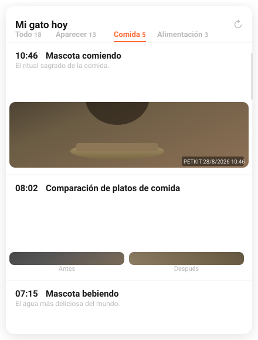
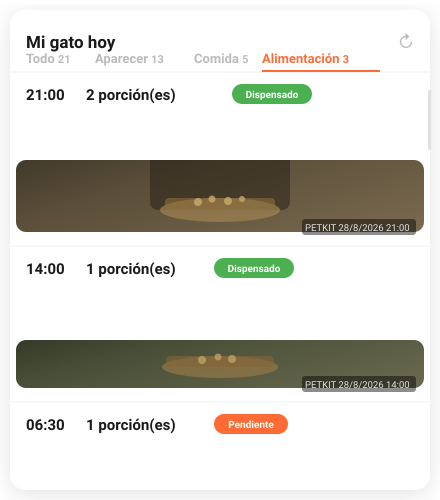

# PetKit History Card

[![GitHub Release][releases-shield]][releases]
[](https://hacs.xyz/docs/faq/custom_repositories)

[](https://ko-fi.com/davbuild/?amount=1)

[releases-shield]: https://img.shields.io/github/release/davbuild/petkit-history.svg?style=for-the-badge
[releases]: https://github.com/davbuild/petkit-history/releases

Lovelace card for Home Assistant that displays the full visual history of your PetKit device, styled after the official app. Compatible with all HA languages.

Compatible with the [Jezza34000/homeassistant_petkit](https://github.com/Jezza34000/homeassistant_petkit) integration.

<p align="center">
  
  &nbsp;&nbsp;
  
</p>

## Features

- Full photo history from HA local media storage
- Scrollable timeline with filter tabs
- Click any photo to open fullscreen
- Automatic before/after bowl comparison
- **Feeding** tab with dispenser schedule (pending + dispensed with photo)
- Multi-language support (ES, EN, FR, DE, PT, IT, NL, CA, PL)

## Installation via HACS

[](https://my.home-assistant.io/redirect/hacs_repository/?owner=davbuild&repository=petkit-history&category=lovelace)

Or manually:

1. HACS → **(⋮)** → Custom repositories
2. URL: `https://github.com/davbuild/petkit-history`
3. Category: **Lovelace**
4. Search for **PetKit History Card** and install
5. Reload Lovelace

## Configuration

```yaml
type: custom:petkit-timeline-card
media_path: Petkit
```

```yaml
type: custom:petkit-timeline-card
title: "My cat today"
media_path: Petkit
hours: 24
language: en                                              # optional, auto-detected
refresh_minutes: 10
dispenser_entity: sensor.feeder_distribution_data_raw    # optional, enables Feeding tab
debug: false                                             # optional, verbose logs in browser console
```

| Option | Required | Default | Description |
|--------|:--------:|---------|-------------|
| `media_path` | ✅ | `Petkit` | Root folder in `/media/local/`. The card auto-discovers the device subfolder. |
| `title` | ❌ | `YumShare today` | Card title |
| `hours` | ❌ | `24` | Hours of history to display |
| `language` | ❌ | auto | Force a language (e.g. `es`, `en`, `fr`) |
| `refresh_minutes` | ❌ | `10` | Minutes between automatic reloads |
| `dispenser_entity` | ❌ | — | Sensor with dispenser schedule. Enables the **Feeding** tab |
| `debug` | ❌ | `false` | Print verbose media-browse logs to the browser console |

## How to find `media_path`

1. In HA go to **Media → Local media**
2. The folder at root level (e.g. `Petkit`) is the `media_path` value

## Feeding tab

Requires `dispenser_entity`. Each entry shows scheduled time, amount, and status badge (orange = pending, green = dispensed). Dispensed entries include the nearest bowl photo.

## Supported languages

Auto-detected from HA. Force with `language: en`.

ES · EN · FR · DE · PT · IT · NL · CA · PL

## Requirements

- Home Assistant 2023.9+
- [homeassistant_petkit](https://github.com/Jezza34000/homeassistant_petkit) with "Fetch images" enabled
- HACS

## License

MIT
